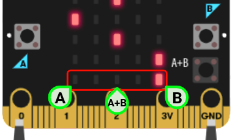

> このページを開く [https://tatsumi33.github.io/micro-rhythm/](https://tatsumi33.github.io/micro-rhythm/)

micro:bit v1.5 / v2 対応のリズムゲームです。

- 電源が入るとすぐにゲームスタート。もう一度始めるときはリセット。
- 上から光が落ちてくるので、一番下の段に来たときにボタンを押す。左:A、中央:A+B、右:B。
- 間違ったタイミングで押すとゲームオーバー。すべて間違わずに押せるとゲームクリア。

できる限りシンプルに作ってあります。「高度なブロック」は使っていません。

「最初だけ」ブロックの先頭にある「拍子」と「速さ」で、ゲームの難しさを調整できます。

## 拡張機能として使用

このリポジトリは、MakeCode で **拡張機能** として追加できます。

* [https://makecode.microbit.org/](https://makecode.microbit.org/) を開く
* **新しいプロジェクト** をクリックしてください
* ギアボタンメニューの中にある **拡張機能** をクリックしてください
* **https://github.com/tatsumi33/micro-rhythm** を検索してインポートします。

## このプロジェクトを編集します 

MakeCode でこのリポジトリを編集します。

* [https://makecode.microbit.org/](https://makecode.microbit.org/) を開く
* **読み込む** をクリックし、 **URLから読み込む...** をクリックしてください
* **https://github.com/tatsumi33/micro-rhythm** を貼り付けてインポートをクリックしてください

## ブロックのプレビュー

この画像はマスター内の最後のコミットからのブロックコードを示しています。
このイメージは更新に数分かかる場合があります。

#### メタデータ (検索、レンダリングに使用)

* for PXT/microbit

